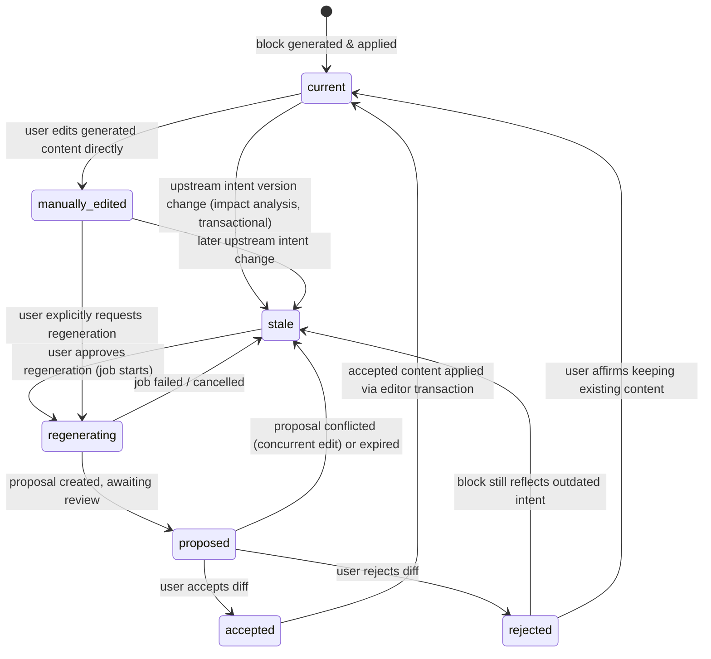
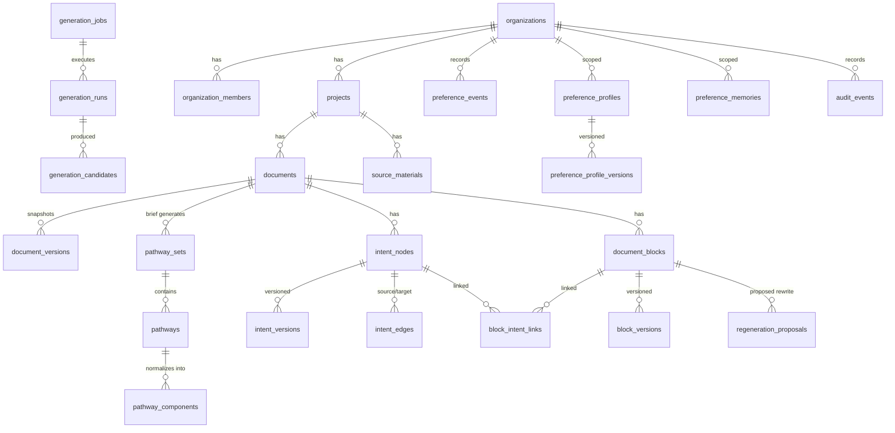

# Data model — logical schema, RLS posture, retention

> **STATUS: PLANNED.** No migrations exist yet (`supabase/` is not initialized in this tree).
> This document is the target logical model distilled from `docs/build-prompt.md` §5, to be
> realized as reviewed SQL migrations under `supabase/migrations/` starting in Milestone 1.
> Table names may be adjusted during implementation; the entities, relationships, and
> invariants below are the requirement. Progress truth stays in `docs/build-state.md`.

The upstream DocFlow tree is frontend-only (see `docs/upstream.md`), so there is no existing
backend schema to reuse or migrate — this model is greenfield on Supabase Postgres.

## 1. Conventions

- **Primary keys**: `id uuid primary key default gen_random_uuid()` unless noted.
- **Timestamps**: `created_at timestamptz not null default now()`; `updated_at` maintained by
  trigger on mutable tables. Append-only and version tables get `created_at` only.
- **JSONB**: used only for flexible, application-validated metadata; every JSONB payload
  carries a `schema_version` field and is validated with Zod before persistence. Relational
  columns are used wherever integrity matters (statuses, foreign keys, hashes).
- **Enums**: statuses and type discriminators will be Postgres enums (or text + CHECK during
  early iteration), never free-form text.
- **Tenancy chain**: `organizations → projects → documents → blocks/intent/…`. Deep tables
  will carry a denormalized `organization_id` (kept consistent by FK + trigger) so RLS
  policies stay one-hop and indexable rather than multi-join. This denormalization is a
  performance decision to validate in Milestone 1.
- **Soft delete**: user-facing containers (`organizations`, `projects`, `documents`,
  `source_materials`) get `deleted_at timestamptz`; RLS hides soft-deleted rows; a scheduled
  purge job hard-deletes after the retention window (§8). Append-only tables are never
  updated, only purged by policy.
- **Correlation**: every AI-triggered write path carries a `correlation_id uuid` so runs,
  jobs, proposals, preference events, and audit events for one user action can be joined.

## 2. RLS posture (global rule)

Every public table will have RLS **enabled and forced**, with negative tests, before it holds
real data (non-negotiable per `CLAUDE.md`). The baseline policy pattern:

- A `security definer` helper, e.g. `private.is_org_member(org_id uuid, min_role role)`,
  resolves membership from `organization_members` for `auth.uid()`.
- **SELECT**: org members (any role), scoped by the row's `organization_id`.
- **INSERT/UPDATE**: role-gated (editor and above for content; owner/admin for tenancy and
  settings tables).
- **DELETE**: owner/admin only, and only where deletion is a legal operation for that table
  (append-only tables get no client DELETE policy at all).
- **Background work**: workers and route handlers using the service-role key bypass RLS, so
  every server-side mutation will re-verify authorization in code before writing
  (defense-in-depth per spec §3.4). The service-role key never reaches the browser.
- **User-scoped rows** (preference tables): policies check `user_id = auth.uid()` in addition
  to org membership; team-scoped rows are readable by the team, writable by admins.

Per-table deviations from this baseline are called out in each table entry below.

## 3. Tenancy and content

### organizations
Tenancy root; the isolation boundary for RLS and preference scoping.
- **Key columns**: `id`, `name`, `slug` (unique), `settings jsonb`, `deleted_at`.
- **Relationships**: parent of `organization_members`, `projects`, and (denormalized) every
  tenant-scoped table.
- **Deletion**: soft delete by owner; scheduled purge cascades hard delete through the entire
  tenant subtree, storage objects, and embeddings.
- **RLS**: SELECT for members; UPDATE/soft-DELETE for owners/admins; creation via server
  (authenticated user becomes owner in the same transaction).

### organization_members
Maps auth users to organizations with a role.
- **Key columns**: `id`, `organization_id` FK, `user_id` FK → `auth.users`, `role`
  (`owner | admin | editor | reviewer | viewer` — final set to confirm; `reviewer` is the
  spec's "commenter/reviewer" role, and `admin` is a tentative addition beyond the spec's
  target set of owner/editor/commenter-reviewer/viewer), `invited_by`,
  unique `(organization_id, user_id)`.
- **Relationships**: the join RLS helpers consult; referenced by audit/preference actor fields.
- **Deletion**: hard delete on removal; removal writes an `audit_events` row. Last-owner
  removal is rejected by constraint/trigger.
- **RLS**: SELECT for members of the same org; INSERT/UPDATE/DELETE for owners/admins only.
  Policies must avoid self-referential recursion (helper function, not inline subquery).

### projects
Groups documents; unit of model pinning.
- **Key columns**: `id`, `organization_id` FK, `name`, `description`,
  `llm_provider` + `llm_model` (the frozen pinned model, e.g. `anthropic` /
  `claude-sonnet-5`; changing it is an explicit, audited user action), `settings jsonb`,
  `deleted_at`.
- **Relationships**: parent of `documents` and `source_materials`; scope target for
  preference rows.
- **Deletion**: soft delete; purge cascades to documents and their subtrees.
- **RLS**: baseline pattern on `organization_id`.

### documents
A single collaborative document.
- **Key columns**: `id`, `project_id` FK, `organization_id` (denormalized), `title`,
  `current_version_id` FK → `document_versions` (nullable until first snapshot),
  `brief jsonb` (normalized brief: goals, audience, constraints, unknowns; schema-versioned),
  `deleted_at`.
- **Relationships**: parent of `document_versions`, `document_blocks`, `pathway_sets`,
  `intent_nodes`. The live collaborative state lives in Yjs (CRDT path preserved per
  spec §3.5; the relay hosting decision is open — see `security.md` T9); this table holds
  durable metadata, not per-keystroke state.
- **Deletion**: soft delete; purge cascades blocks, versions, intent graph, pathways,
  proposals, and document-scoped memories/embeddings.
- **RLS**: baseline pattern; write requires editor role.

### document_versions
Immutable document-level snapshots (recovery, audit export, and the anchor `block_versions`
can reference).
- **Key columns**: `id`, `document_id` FK, `organization_id`, `snapshot` (serialized document
  state — whether Yjs update/snapshot bytes or ProseMirror JSON is an open implementation
  question tied to the Hocuspocus hosting decision), `snapshot_kind`, `created_by`,
  `cause` (`manual | pre_regeneration | scheduled | milestone`), `created_at`.
- **Relationships**: referenced by `documents.current_version_id` and by `block_versions`.
- **Deletion**: append-only; thinned by retention policy (§8); purged with parent.
- **RLS**: SELECT for members; INSERT server-side only (no client UPDATE/DELETE policies).

### source_materials
User-supplied briefs, references, and uploads that ground generation.
- **Key columns**: `id`, `project_id` FK, `organization_id`, `document_id` FK nullable,
  `storage_path` (Supabase Storage object), `mime_type`, `title`, `extracted_text`,
  `extraction_status`, `injection_scan jsonb` (planned prompt-injection screening result —
  stored materials are untrusted input per spec §9), `deleted_at`.
- **Relationships**: referenced from generation run input snapshots by ID; embeddings for
  retrieval will reference this table (embedding rows co-located or in a satellite table —
  decided at migration time under the §9 embedding policy).
- **Deletion**: user-deletable (soft, then purge). Purge must remove the storage object,
  extracted text, and any derived embeddings (deletion propagation is a tested requirement).
- **RLS**: baseline pattern; storage bucket policies mirror the table policy.

## 4. Pathways and intent

### pathway_sets
One pathway-generation event for a brief, containing the 3–5 alternatives.
- **Key columns**: `id`, `document_id` FK, `organization_id`, `brief_snapshot jsonb` (the
  normalized brief as ranked, so later edits don't rewrite history), `generation_run_id` FK,
  `status` (`generating | ready | failed | superseded`), `created_by`.
- **Relationships**: parent of `pathways`; child of a `generation_runs` row.
- **Deletion**: retained while the document lives (selection/rejection history is learning
  evidence); purged with document.
- **RLS**: baseline pattern.

### pathways
A distinct proposed writing strategy.
- **Key columns**: `id`, `pathway_set_id` FK, `organization_id`, `title`,
  `one_sentence_approach`, `thesis`, `audience_strategy`, `tone`, `structure jsonb`,
  `key_decisions jsonb`, `assumptions jsonb`, `tradeoffs jsonb`, `evidence_needed jsonb`,
  `ending_strategy`, `difference_from_others`, `preference_match_explanation` (always
  labelled application-generated in UI), `rank int`, `rank_basis jsonb` (why ranked here:
  brief constraints + retrieved preference IDs), `status`
  (`proposed | selected | rejected | merged_source | derived`), `derived_from_set jsonb`
  nullable (provenance for blended pathways), `metadata jsonb`.
- **Relationships**: child of `pathway_sets`; source/target of `pathway_components`;
  referenced by `intent_nodes.pathway_id` and `document_blocks.pathway_id`; each pathway is
  also a `generation_candidates` row's validated result.
- **Deletion**: never deleted individually (rejected pathways are preference evidence);
  purged with document.
- **RLS**: baseline pattern; status transitions (select/reject/merge) are server-verified
  mutations that also write `preference_events` and `audit_events`.
- **Invariant**: alternatives in one set must be meaningfully different; near-duplicates are
  detected (embeddings + structural heuristics) and repaired before the set is `ready`.

### pathway_components
Optional normalized units of a pathway, used when the user combines pathways.
- **Key columns**: `id`, `pathway_id` FK, `organization_id`, `component_type`
  (e.g. `thesis | structure_item | tone | ending | evidence_plan`), `position int`,
  `content jsonb`, `source_pathway_id` FK nullable (provenance when a derived pathway
  borrows a component from another pathway).
- **Relationships**: children of `pathways`; a blended pathway's components point back at
  their source pathways, satisfying the explicit-provenance requirement for blending.
- **Deletion**: cascades with pathway/document purge.
- **RLS**: baseline pattern.

### intent_nodes
Typed nodes of the versioned intent graph created from the selected pathway.
- **Key columns**: `id`, `document_id` FK, `organization_id`, `pathway_id` FK,
  `node_type` (`brief | thesis | section_goal | paragraph_goal | audience | tone |
  constraint | evidence | objection | transition | ending`), `current_version_id` FK →
  `intent_versions`, `position jsonb` (outline ordering), `status` (`active | archived`).
- **Relationships**: endpoints of `intent_edges`; linked to blocks through
  `block_intent_links`; content lives in `intent_versions` (the node row is stable identity).
- **Deletion**: archived rather than deleted while the document lives (history must survive
  intent edits); purged with document.
- **RLS**: baseline pattern; edits go through a server path that creates a new
  `intent_versions` row, runs impact analysis, and writes audit events — never a bare UPDATE.

### intent_edges
Directed, typed relationships between intent nodes.
- **Key columns**: `id`, `document_id` FK, `organization_id`, `source_node_id` FK,
  `target_node_id` FK, `edge_type` (`derives_from | depends_on | supports | contrasts_with |
  satisfies | constrains`), unique `(source_node_id, target_node_id, edge_type)`,
  CHECK `source_node_id <> target_node_id`.
- **Relationships**: the `depends_on` subgraph drives deterministic impact analysis
  (downstream traversal → affected blocks).
- **Acyclicity requirement**: the dependency portion of the graph (`depends_on`, and
  `derives_from` as lineage) **must remain acyclic**. Enforcement will be layered:
  application-level cycle check before insert (traversal in the mutation transaction) plus a
  database safeguard (planned: trigger running a recursive-CTE reachability check on
  dependency-class edges; its cost at realistic graph sizes needs prototyping). Cycle
  rejection is a required unit and database test, not just a convention. Non-dependency
  edge types (`supports`, `contrasts_with`) are exempt from the acyclicity rule.
- **Deletion**: hard delete allowed as part of versioned intent edits (edge changes are
  captured in the affected nodes' new versions and audit events); purged with document.
- **RLS**: baseline pattern.

### intent_versions
Immutable history of every intent node's content.
- **Key columns**: `id`, `intent_node_id` FK, `organization_id`, `version int` (unique per
  node, monotonic), `content jsonb` (purpose, assumptions, constraints, tone, evidence
  needs — user-facing fields only, schema-versioned), `edited_by`, `edit_kind`
  (`generated | user_edit | merge`), `correlation_id`, `created_at`.
- **Relationships**: `intent_nodes.current_version_id` points at the latest;
  `regeneration_proposals` and impact previews reference the triggering version.
- **Deletion**: append-only; no client UPDATE/DELETE; purged with document.
- **RLS**: SELECT for members; INSERT via server-verified intent-edit path only.

## 5. Document provenance

### document_blocks
Stable identity and provenance state for every generated (or provenance-tracked) block. The
same `id` is stamped into the Tiptap block attributes, independent of editor position.
- **Key columns**: `id` (the stable block UUID), `document_id` FK, `organization_id`,
  `pathway_id` FK, `order_key` (fractional/ordering metadata — editor is source of truth for
  position; this is for non-editor consumers), `content_hash text` (hash of current accepted
  content; the concurrency/stale-write guard), `lock_state` (`unlocked | locked`),
  `locked_by` + `locked_at`, `freshness_state` (`current | stale | regenerating | proposed |
  accepted | rejected | manually_edited` — machine in §7), `current_generation_run_id` FK,
  `provenance_version int`, `last_event_at`.
- **Relationships**: linked to intent via `block_intent_links`; history in `block_versions`;
  pending rewrites in `regeneration_proposals`.
- **Deletion**: a block removed in the editor is marked deleted/archived (kept for history
  and audit until document purge), not hard-deleted immediately.
- **RLS**: SELECT for members; state mutations (lock/unlock, freshness transitions) via
  server-verified paths that emit preference + audit events. Lock/unlock respects roles.

### block_intent_links
Many-to-many links between blocks and intent nodes, with roles.
- **Key columns**: `id`, `block_id` FK, `intent_node_id` FK, `organization_id`, `role`
  (`primary | supporting | constraint`), unique `(block_id, intent_node_id)`; partial unique
  index guaranteeing **exactly one `primary` link per block** (spec §3.2).
- **Relationships**: the join that impact analysis resolves (affected intent nodes → linked
  blocks) and that the Intent Lens reads.
- **Deletion**: replaced transactionally when provenance changes (bump
  `document_blocks.provenance_version`); purged with document.
- **RLS**: baseline pattern; writes server-side with the generation/regeneration flows.

### block_versions
Immutable per-block content history.
- **Key columns**: `id`, `block_id` FK, `organization_id`, `version int` (unique per block),
  `content jsonb` (block content or a reference into a `document_versions` snapshot),
  `content_hash`, `generation_run_id` FK nullable, `cause` (`generated | regeneration_accepted
  | manual_edit | revert`), `created_by`, `correlation_id`, `created_at`.
- **Relationships**: the Intent Lens "generation history" panel and diffs read from here.
- **Deletion**: append-only; thinned per retention policy (§8); purged with document.
- **RLS**: SELECT for members; INSERT server-side only.

### regeneration_proposals
A proposed replacement for one block, awaiting user review. Proposals never mutate accepted
content directly.
- **Key columns**: `id`, `block_id` FK, `document_id` FK, `organization_id`,
  `generation_job_id` FK, `generation_run_id` FK, `original_content_hash` (hash of the block
  when regeneration was approved — the guard compared before apply), `proposed_content jsonb`,
  `diff_metadata jsonb`, `status` (`pending | accepted | rejected | conflicted | expired |
  superseded`), `resolved_by` + `resolved_at`, `expires_at`, `correlation_id`.
- **Relationships**: produced by a regeneration job/run; resolution writes
  `block_versions` (on accept), `preference_events`, and `audit_events`.
- **Conflict rule**: if the block's live `content_hash` no longer matches
  `original_content_hash` at apply time (collaborator edited mid-flight), the proposal is
  marked `conflicted` and offered for review — it must never overwrite the newer edit.
- **Deletion**: expired/resolved proposals are purged by cron after a short window (§8).
- **RLS**: SELECT for members; accept/reject via server-verified mutation; no client INSERT.

## 6. AI runs and operational state

### generation_runs
One record per model invocation, for reproducibility and cost accounting.
- **Key columns**: `id`, `organization_id`, `project_id` FK, `document_id` FK nullable,
  `operation` (`pathway_generation | draft_generation | block_explanation | regeneration |
  preference_summarization | embedding`), `provider` + `model` (the pinned identifier, e.g.
  `claude-sonnet-5`, recorded per run), `prompt_version`, `schema_version`,
  `input_snapshot jsonb` (**sanitized** — see §8), `validated_output jsonb` (post-Zod),
  `usage jsonb` (tokens), `cost_estimate`, `latency_ms`, `status`
  (`running | succeeded | failed | cancelled`), `error_category` + `error_detail`,
  `correlation_id`, `created_at` + `completed_at`.
- **Relationships**: parent of `generation_candidates`; referenced by `pathway_sets`,
  `document_blocks`, `block_versions`, `regeneration_proposals`.
- **Deletion**: append-only; snapshots redacted after the retention window (§8); purged with
  tenant.
- **RLS**: SELECT for members (it powers user-facing provenance); INSERT/UPDATE server-only.

### generation_candidates
Individual candidates (a pathway, a block draft) produced within a run, including ones that
were repaired or discarded — needed for the duplicate-detection audit trail.
- **Key columns**: `id`, `generation_run_id` FK, `organization_id`, `candidate_index int`,
  `kind` (`pathway | block | explanation`), `raw_validity` (`valid | repaired | rejected`),
  `payload jsonb` (validated content), `similarity jsonb` (dedupe scores vs. siblings),
  `accepted boolean`.
- **Relationships**: an accepted pathway candidate materializes as a `pathways` row; an
  accepted block candidate as a proposal or block version.
- **Deletion**: follows `generation_runs` retention.
- **RLS**: SELECT for members; writes server-only.

### generation_jobs
Durable, idempotent job state for anything that outlives a request (spec §4.4).
- **Key columns**: `id`, `idempotency_key` (unique), `organization_id`, `owner_user_id`,
  `job_type` (`pathway_generation | draft_generation | regeneration | embedding |
  preference_summarization | retention_cleanup | retry_dead_letter`), `payload jsonb`,
  `status` (`queued | running | succeeded | failed | cancelled | dead_letter`),
  `progress jsonb` (drives Realtime Broadcast updates; token streams are **not** written
  through the database), `attempt_count`, `max_attempts`, `last_error_category`,
  `cancellation_requested boolean`, `correlation_id`, `scheduled_at | started_at |
  finished_at`.
- **Relationships**: a job produces `generation_runs`; regeneration jobs produce
  `regeneration_proposals`.
- **Deletion**: terminal rows purged after the retention window (§8).
- **RLS**: SELECT limited to the owning org (for progress UI); all writes server/worker-only.

## 7. Freshness-state machine (`document_blocks.freshness_state`)

States: `current`, `stale`, `regenerating`, `proposed`, `accepted`, `rejected`,
`manually_edited`. The block's freshness summarizes provenance status; per-proposal detail
lives on `regeneration_proposals.status`.

Rules:
- **Marking stale is transactional**: impact analysis resolves affected blocks via
  `depends_on` traversal and `block_intent_links`, and marks them in one transaction.
- **Locked blocks** (`lock_state = locked`) are excluded from stale-marking's regeneration
  scope: they are reported in the impact preview as a consistency risk but are never
  regenerated until explicitly unlocked. Lock is orthogonal to freshness.
- **`accepted` and `rejected` are transitional**: they record the review outcome and resolve
  to `current` or `stale` when the outcome is applied; the durable record of the decision is
  the proposal row + `block_versions` + events.
- **`manually_edited`** marks provenance as user-overridden: the Intent Lens must present the
  content as manually adjusted, and regeneration of such a block always requires explicit
  user confirmation.
- Every transition writes `audit_events`; review outcomes also write `preference_events`.
- The transition set above is the acceptance criterion for the state-machine unit tests
  (including illegal-transition rejection).

## 8. Retention and redaction policy notes

Defaults below are planning values to be confirmed against the user's budget/data-residency
constraints and encoded in an ADR + `retention_cleanup` jobs before Milestone 6.

- **No chain-of-thought, ever**: provider private reasoning fields are discarded at the
  `ModelGateway` boundary before anything is persisted, logged, or streamed to the client.
  No table in this model has a column for model "thinking", and Greptile rules enforce that
  none is added. If a provider designates an explicitly safe summary field, only that field
  may be stored, clearly labelled.
- **Sanitized input snapshots**: `generation_runs.input_snapshot` stores what is needed to
  reproduce a run — prompt version + resolved template variables by reference (IDs of brief,
  intent versions, memory rows) plus the compact preference context actually sent. It must
  never contain secrets, provider keys, other tenants' data, or raw hidden prompt material
  users may not access. Sanitization happens server-side before insert and is covered by
  tests.
- **Snapshot redaction window**: full `input_snapshot` / `validated_output` bodies are
  retained for a bounded window (planning default: 90 days) for debugging and provenance,
  then redacted to IDs, hashes, counts, and usage metadata. Run rows themselves (model,
  prompt version, cost, latency) are kept for the life of the tenant.
- **Proposals**: `regeneration_proposals` carry `expires_at` (planning default: 14 days
  unresolved → `expired`); resolved/expired rows purged after 30 days (decisions survive in
  versions + events).
- **Jobs**: terminal `generation_jobs` rows purged after 30 days; `dead_letter` rows kept 90
  days for diagnosis.
- **Version thinning**: `document_versions`/`block_versions` may be thinned by age-tiered
  policy (keep all recent, sample older) — exact tiers TBD; never thin versions referenced
  by unresolved proposals or audit holds.
- **Deletion propagation**: purging a tenant, document, source material, or preference
  memory must remove derived embeddings and storage objects so revoked content cannot be
  retrieved (tested requirement).
- **User data rights**: preference memory is user-visible, exportable, and resettable;
  a reset writes a `preference_events` reset marker and deactivates/deletes the affected
  inferred rows. Observability events use IDs/hashes/counts, never raw document text by
  default.
- **Audit**: `audit_events` are exempt from user-initiated deletion; retained for the life
  of the tenant (bounded audit retention window to confirm), purged only with tenant purge.

## 9. Embedding model policy

- **Exactly one embedding model and one dimension per deployment.** All `vector(N)` columns
  share that dimension. The chosen model + dimension will be recorded in configuration and
  in an ADR. **No embedding model has been selected yet** — the spec allows proposing a safe
  default; the decision is pending (see open questions).
- **Never compare vectors across models.** Every embedded row stores `embedding_model` and
  `embedding_version` alongside the vector; retrieval functions filter on the active model so
  a future model change cannot silently mix spaces.
- **Model change = re-embedding migration**: bump version, background re-embed via
  `generation_jobs`, cut over retrieval, then drop old vectors. No dual-model coexistence in
  ranking.
- **Where embeddings live (planned)**: `preference_memories.embedding` (§10); satellite
  embedding tables for `source_materials` chunks and document/block content as retrieval
  needs materialize (Milestones 2 and 5) — same policy applies.
- **Indexing**: HNSW (or IVFFlat if measurements favor it) added only after measuring
  realistic row counts; premature indexes are avoided in early migrations.
- **RLS-compatible retrieval**: similarity search runs through functions that enforce tenant
  scoping (`organization_id` + scope filters) so cross-tenant retrieval is impossible even
  with a crafted query — a required negative test.
- **Pipeline**: embedding generation is asynchronous and durable (trigger/queue/cron pattern
  per Supabase's automatic-embeddings guidance), idempotent, with retries and deletion
  propagation.

## 10. Frozen-model personalization

Personalization happens around the pinned model (application-level adaptation); nothing here
changes model weights, and UI language must say the *application* learned a preference.

### preference_events
Append-only behavioral and explicit signals — the raw evidence stream.
- **Key columns**: `id`, `organization_id`, `user_id`, `event_type` (`pathway_selected |
  pathway_rejected | pathway_merged | intent_edited | proposal_accepted | proposal_rejected |
  block_locked | block_unlocked | manual_edit | explicit_rating | explicit_preference |
  memory_reset`), `target jsonb` (typed refs: pathway/block/intent/proposal IDs),
  `context jsonb` (document type, audience, brief digest — enough to aggregate meaningfully),
  `correlation_id`, `created_at`. No `updated_at`; rows are immutable.
- **Relationships**: aggregation input for `preference_profiles` and `preference_memories`;
  emitted by the same transactions that change pathway/proposal/lock state.
- **Deletion**: append-only; hard-deleted on user data-deletion request and on tenant purge.
- **RLS**: SELECT for the owning user (and org admins for team-scoped aggregates); INSERT
  server-side within the emitting mutation; no client UPDATE/DELETE.

### preference_profiles
The current structured, editable preference state for a scope.
- **Key columns**: `id`, `organization_id`, `scope_type` (`user | organization | project |
  document_type | audience`), `scope_ref` (e.g. `user_id`, `project_id`, or a label),
  unique `(organization_id, scope_type, scope_ref)`, `profile jsonb` (tone, structure,
  detail level, evidence style, terminology, audience assumptions — schema-versioned),
  `provenance` (`explicit | inferred | mixed`), `confidence jsonb` (per-field),
  `enabled boolean` (user kill-switch), `current_version_id` FK.
- **Relationships**: snapshotted into `preference_profile_versions`; consulted (with
  `preference_memories`) when assembling pathway-generation context and reranking.
- **Precedence rule**: explicit task instructions > explicit profile entries > inferred
  entries; scope precedence and conflict resolution are defined in domain code and tested.
- **Anti-overfitting rule**: one isolated action never promotes a permanent preference —
  inferred entries require repeated evidence (threshold) or explicit confirmation.
- **Deletion**: user can edit, disable, export, or reset; reset archives the current version
  and clears inferred content. Purged with tenant.
- **RLS**: user-scope rows readable/writable by that user; org/team scope readable by
  members, writable by admins.

### preference_memories
Retrievable, embedded evidence units: approved examples and summarized patterns.
- **Key columns**: `id`, `organization_id`, `scope_type` + `scope_ref` (as above),
  `memory_type` (`approved_example | rejected_pattern | summarized_pattern | team_rule`),
  `content jsonb` (user-visible text + structured tags), `embedding vector(N)`,
  `embedding_model` + `embedding_version` (§9), `confidence`, `evidence_count int`,
  `source_event_ids uuid[]` (provenance back to `preference_events`), `lifecycle_state`
  (`candidate | active | disabled | expired | deleted`), `expires_at`, `last_retrieved_at`.
- **Lifecycle**: rows enter as `candidate` (insufficient evidence — not retrieved into
  prompts); promotion to `active` requires the evidence threshold or explicit user approval;
  users can `disable`; stale/contradicted memories expire; `deleted` triggers embedding
  removal. Only `active` rows participate in retrieval.
- **Relationships**: retrieved (tenant-scoped, §9) to build the compact preference context
  for pathway generation and reranking; every memory is inspectable in the user-facing
  memory UI.
- **Deletion**: hard delete on user deletion/reset with embedding propagation; expiry via
  cron; purged with tenant.
- **RLS**: as `preference_profiles`; retrieval only via the RLS-compatible search functions.

### preference_profile_versions
Immutable history of profile states for audit and rollback.
- **Key columns**: `id`, `preference_profile_id` FK, `organization_id`, `version int`
  (unique per profile), `profile jsonb`, `change_summary`, `changed_by`, `cause`
  (`user_edit | inference_update | reset | rollback`), `created_at`.
- **Relationships**: `preference_profiles.current_version_id` points at the latest; rollback
  creates a new version copying an older one (history is never rewritten).
- **Deletion**: append-only; purged with tenant.
- **RLS**: SELECT mirrors the parent profile's read policy; INSERT server-side only.

## 11. Audit

### audit_events
The append-only record of consequential actions across the product.
- **Key columns**: `id`, `organization_id`, `actor_user_id` (nullable for system actions,
  with `actor_type` `user | system | job`), `action` (namespaced verb, e.g.
  `intent.version_created`, `proposal.accepted`, `block.locked`, `member.removed`,
  `profile.reset`, `project.model_changed`), `target_type` + `target_id`,
  `before_ref` + `after_ref` (references to version rows, not duplicated content),
  `correlation_id`, `metadata jsonb`, `created_at`. Indexed on
  `(organization_id, created_at)` and `(target_type, target_id)`.
- **Relationships**: written by every server-verified mutation listed above; `before/after`
  refs point at `intent_versions`, `block_versions`, `preference_profile_versions`, etc.
- **Deletion**: no client or user-initiated deletion; retention per §8; purged with tenant.
- **RLS**: SELECT for org members (admin-only for membership/security actions — split to
  confirm); INSERT exclusively server-side (service role or security-definer function); no
  UPDATE/DELETE policies exist.

## 12. Entity overview

